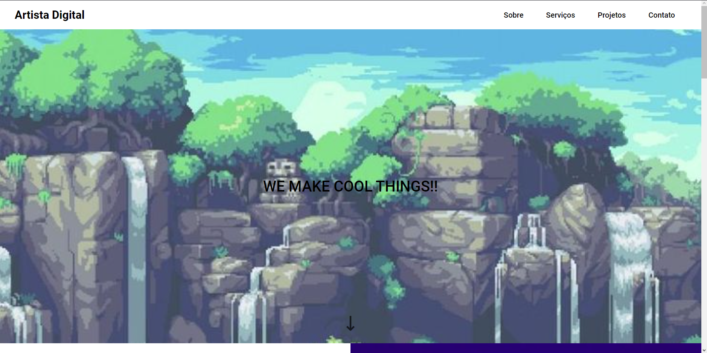
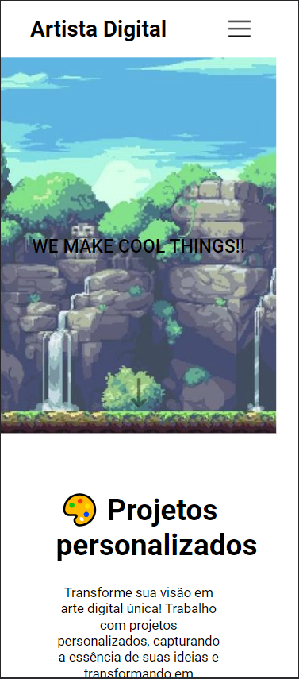

# HMTL + CSS Challenge / Landing Page
## (Last Update) - 25/07/2023
### This project is a milestone of a FullStack developer course, serving to reinforce foundational principles and then upload it to a GitHub repository.

  <a href="#-technologies">Technologies</a>&nbsp;&nbsp;&nbsp;|&nbsp;&nbsp;&nbsp;
  <a href="#-project">Project</a>&nbsp;&nbsp;&nbsp;|&nbsp;&nbsp;&nbsp;
  <a href="#-layout">Layout</a>

The Project is currently accessible at:
https://bigodrigo.github.io/landing-page/

## 🚀 Technologies

This project has been developed employing the following technologies:

- HTML and CSS

## 💻 Project

The Project forms a component of a series of challenges and milestones aimed at improvement throughout the course. Post-class, the students endeavour to independently replicate a particular task. In this instance, three simple exercises have been consolidated onto a single page and uploaded to GitHub.

## 🔖 Layout

    
Web Layout:

    

    
Mobile and Tablet Layout:

    
    

## :thought_balloon: Noteworthy Observations:

- [ ] The Responsive Menu in Mobile and Tablet operates as a Dropdown created solely using CSS, without any JavaScript assistance.

- [ ] The animations for the Menu and Arrow are compelling and may serve as inspiration for upcoming projects. It was a deliberate choice to make the Hero component relatively smaller in order to encourage users to scroll down and explore further.
